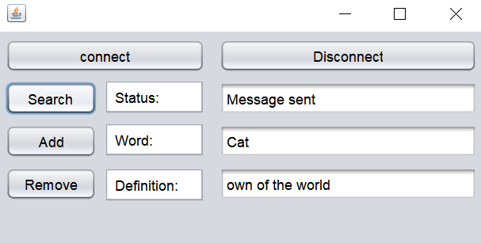
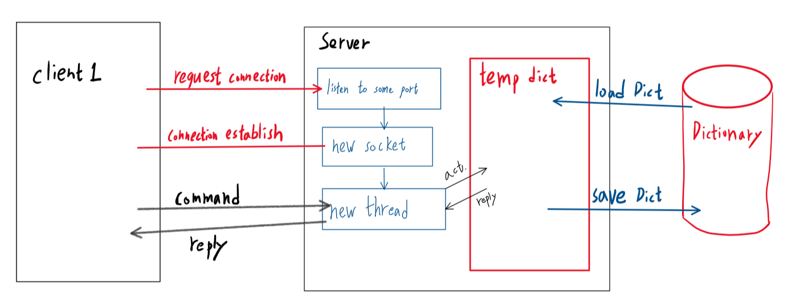

## COMP90015 Distributed Systems - Assignment 1 

### Multi-threaded Dictionary Server

---

Name: Chen-An Fan

Student ID: 1087032

User Name: chenanf

#### Introduction

In this assignment, a client-server architecture is used to design and implement a multi-threaded server that allows multiple clients to search, add, or remove a word in the dictionary concurrently. Socket and threading programming are required to be the lowest level of abstraction for network communication and concurrency.

#### Architecture

One client class and one server class are used to present Client-server architecture. In my server class, I use thread-per-connection to achieve multi-thread. Every client requests connection would create a new thread in the server program. Moreover, a GUI is built for client class to achieve user friendly goal.

#### Interaction

TCP is used as the protocol between server and clients to achieve reliable communication; and all communication are through sockets. Moreover, JSON is used to store the dictionary. BufferedReader and BufferedWriter are used to send and receive string message between server and clients. The beginning letter of each string will be treated as an command.

> `a`: for adding a new word to the dictionary
> `d`: for deleting an existing word in the dictionary
> `f`: for searching a word in the dictionary

#### Failure Model

Exceptions are well handled in both client and server classes. Input command arguments on console are also checked. In GUI.java (client) the method `validIP(String hostname)` is used to insure input server address is valid. Other error also including I/O are also catched and handled.

> GUI (Client) program error handle table:
> `exit(1)`: Wrong command line arguments on console
> `exit(2)`: Wrong server address

#### System Components & Overall Class Design

- **Server.java**

  This is the server program with multi-threads. In this program, the server will count and show how many clients are connected to it on the console. And this server uses buffered reader to read the command from client side. Three `syncronized` methods:

  1. `getDefinition`:
     When user input a word, the method will search its definition in the dictionary and send back to client's GUI. 
     Error handling:

     - If this word is not in the dictionary, a *Not Found* message will sent. The input word for search is case insensitive.

  2. `addWord`:
     This method will add a word with its meaning to the dictionary and return successful status to client's GUI. The word added are visible to all clients. 

     Error handling:

     - If the user input a word without a meaning, then the word will not be added and a warning message will sent to the client's GUI. 
     - If the user add a world that is already in the dictionary, then the world will not be added and a warning message will sent to the client's GUI.

  3. `removeWord`:
     This method is for user to remove a word and its meaning in the dictionary. A word been removed are not visible to all clients. After remove, a notification will sent to client's GUI.
     Error handling:

     - If the word that the user input is not in dictionary, no action will take and a *Not Found* warning message will be sent to the user. 

  These three method are `syncronized`. Only one client can implement one of them at one time, to avoid concurrently read/write on the share resource.

- **GUI.java**

  In the client's GUI, there are five button and three text field for input and output.

  - `jTextField1`: show the status (connection status, warning message, action status)

  - `jTextField2`: for user to input the word to search its definition

  - `jTextField3`: show the definition of the word which the user searches; or let user input the definition when adding the word to dictionary.

  - `jButton1`: click for connecting to server

  - `jButton2`: click for searching the word and get the definition

  - `jButton3`: click for adding a word with definition

  - `jButton4`: click for removing a word

  - `jButton5`: click to disconnect with server

  
  
  
Picture 1. GUI

#### 

#### Interaction Diagram

Picture 2. Interaction

Interaction Step:

1. When the server run, it will first load the dictionary file from the local drive. Then the server starts listening on some port for waiting client connection.
2. Client send connection request to server.
3. Server create a new socket to establish connection with client.
4. New thread is created for the new client and wait for client send command.
5. When client sends command to the server, the server will take action (query, add, or remove) to the loaded dictionary  (temp dict) and get the reply. Then the server send the reply back to client.
6. After finishing the actions, the client could choose to disconnect with server.
7. If the there is no client connected to the server, the server will stop listening and save the loaded dictionary (temp dict) to the local drive.

#### Run

> java -jar DS_pro1_Server.jar 7654 myDict.json
> java -jar DS_pro1_Client.jar localhost 7654

#### Analysis

This program has some limitations. 

- First, one client could not query while other client is querying. Clients should be allowed to concurrently query, since query would not cause the resource competition problem. It only needs to prevent one client queries while other client is adding or removing a word. 
- Second, this dictionary server is using thread-per-connection. Every time a new client request comes, the server needs to create a new worker. This is less efficient than worker-pool architecture.

#### Conclusion

This dictionary project allows multiple clients connect to the dictionary server and do actions (query, add word, remove word) by using socket and thread programming. This is just a simple dictionary server with limited functions. There are some place could be improved and add more functions to make the dictionary more useful.

